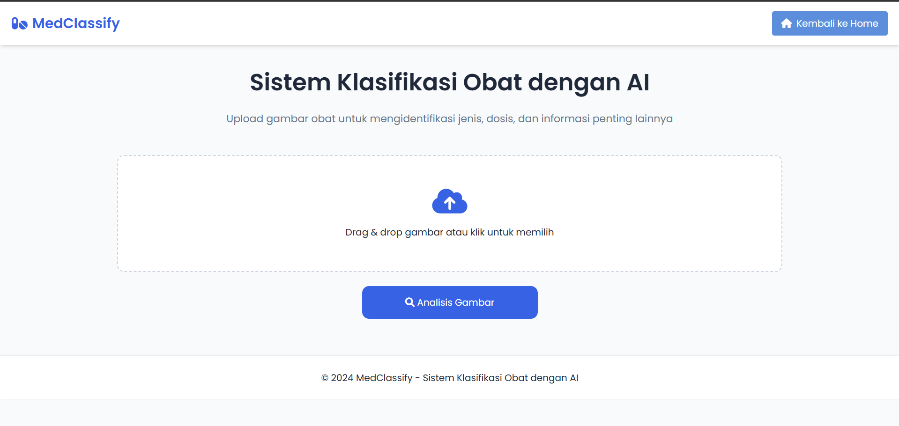

# MedClassify - Sistem Klasifikasi Obat dengan AI




MedClassify adalah sistem klasifikasi obat berbasis AI yang dapat mengidentifikasi jenis obat melalui gambar dan memberikan informasi detail tentang obat tersebut. Proyek ini menggunakan deep learning dengan arsitektur MobileNetV2 dan diimplementasikan menggunakan Flask web framework.

## 🌟 Fitur Utama

- 📸 Upload gambar obat melalui drag & drop atau file picker
- 🤖 Klasifikasi obat menggunakan AI (MobileNetV2)
- 📊 Tingkat akurasi prediksi yang tinggi
- 📋 Informasi detail obat (dosis, deskripsi, efek samping)
- 🚦 Rekomendasi berdasarkan tingkat kepercayaan prediksi
- 📱 Responsive design untuk semua ukuran layar

## 🛠️ Teknologi yang Digunakan

- **Backend**: Python, Flask
- **Frontend**: HTML5, CSS3, JavaScript
- **AI/ML**: TensorFlow, MobileNetV2
- **Data Processing**: NumPy, Pillow
- **Development**: Git, Visual Studio Code

## 📋 Prasyarat

- Python 3.8 atau lebih baru
- pip (Python package manager)
- Git
- Virtual environment (opsional tapi direkomendasikan)

## 🚀 Cara Instalasi

1. Clone repository
2. Buat dan aktifkan virtual environment
3. Install dependencies
4. Jalankan aplikasi
5. Buka browser dan akses

## 🎯 Penggunaan

1. Buka aplikasi di browser
2. Upload gambar obat melalui drag & drop atau klik area upload
3. Klik tombol "Analisis Gambar"
4. Sistem akan menampilkan hasil klasifikasi dan informasi detail obat

## 🔧 Development

### Persiapan Dataset
```bash
python download_images.py    # Unduh gambar dataset
python organize_dataset.py   # Organisir dataset
python prepare_dataset.py    # Persiapkan gambar
```

### Training Model
```bash
python train_model.py        # Train model AI
python evaluate_model.py     # Evaluasi performa model
```

## 📊 Performa Model

- Accuracy: 99.58%
- Precision: 99.47%
- Recall: 99.48%
- F1-Score: 99.47%


## 📞 Kontak

- Email: raygavriel91@gmail.com
- LinkedIn: [ray-gavriel](https://linkedin.com/in/ray-gavriel)

## 🙏 Acknowledgments

- Dataset obat dari berbagai sumber
- Inspirasi UI/UX dari berbagai aplikasi kesehatan


---
⭐ Jika proyek ini membantu, berikan star di GitHub!